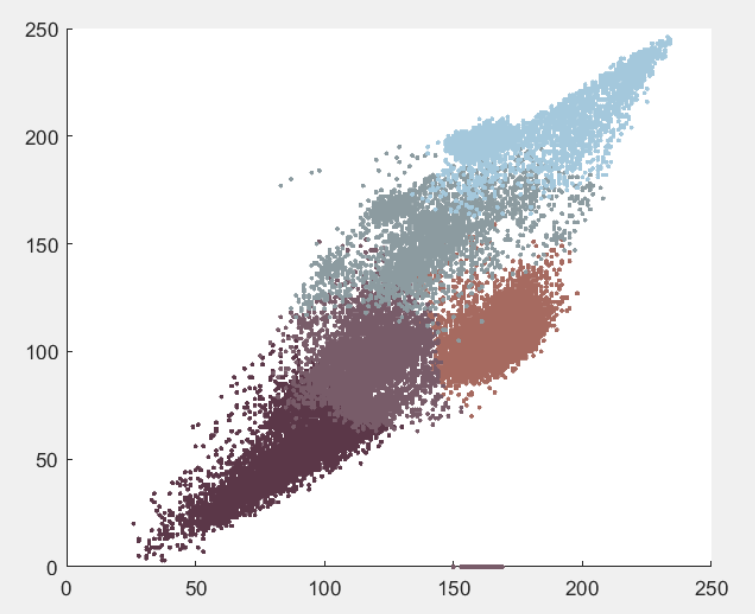
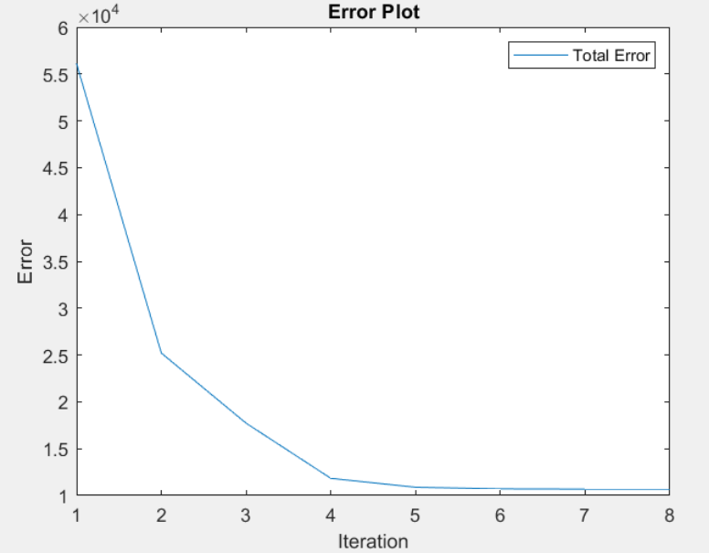

# K-clustering-Colours
> The program applies unsuperverised learning to identify natural clusters within an unlabelled data set. An iterative process of using the K-means algorithm groups at least 5 colours present in the dataset (house.tiff).

## Table of contents
* [General info](#general-info)
* [Technologies](#technologies)
* [Classified Data](#classified-data)
* [Status](#status)
* [Contact](#contact)

## General info
The purpose of this project is to explore the K-means algorithm to apply unsupervised learning methods. 

## Technologies
* MATLAB- version R2020a

## Classified Data

> 5 Colours in RGB Space (px)

> Error Plot

## Status
Project is: _finished_

## Contact
> Created by [@akansha-n888](https://www.linkedin.com/in/akansha-nagar/) and @tsnagata
